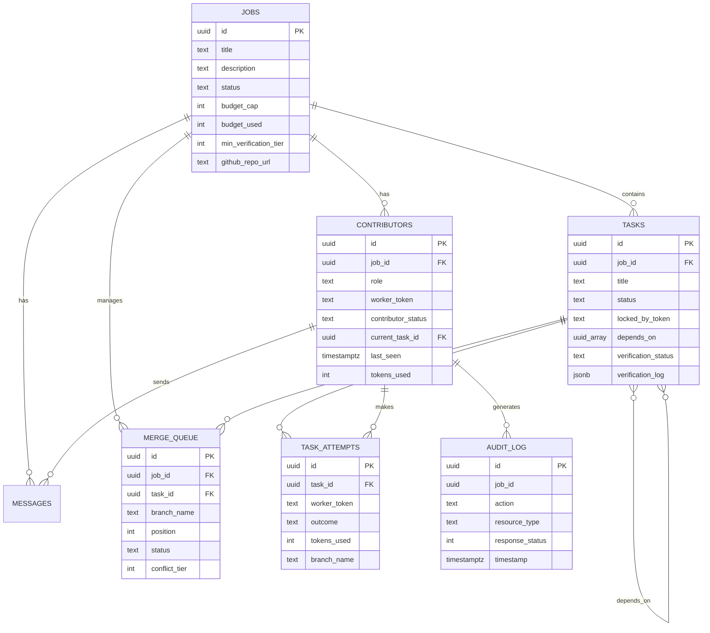

# 10 — Database Schema v2

> Complete schema specification for SwarmBuild v2. Shows all new tables, column additions, indexes, and constraints needed to support fault tolerance, task DAG, merge queue, verification, audit logging, and cost tracking.

---

## Table of Contents

1. [Schema Overview](#schema-overview)
2. [Modified Tables](#modified-tables)
3. [New Tables](#new-tables)
4. [Indexes & Constraints](#indexes--constraints)
5. [Complete Migration Script](#complete-migration-script)
6. [Entity-Relationship Diagram](#entity-relationship-diagram)

---

## Schema Overview

### v1 Tables (Existing)

| Table | Purpose | v2 Changes |
|-------|---------|------------|
| `jobs` | Core entity: idea → plan → execution | + budget columns, + min_verification_tier |
| `contributors` | Who's running agents | + contributor_status, + current_task_id, + metrics |
| `tasks` | Agent task board | + depends_on, + verification columns |
| `messages` | Lobby chat | No changes |
| `comments` | Community discussion | No changes |
| `votes` | Upvotes | No changes |
| `credit_events` | Credit ledger | No changes |
| `profiles` | User profiles | No changes |
| `job_logs` | Agent stdout/stderr | No changes |

### v2 Tables (New)

| Table | Purpose | Reference Doc |
|-------|---------|---------------|
| `task_attempts` | Track every claim attempt with outcome | [01-FAULT-TOLERANCE.md](./01-FAULT-TOLERANCE.md) |
| `merge_queue` | FIFO merge processing queue | [02-MERGE-RESOLUTION.md](./02-MERGE-RESOLUTION.md) |
| `audit_log` | All API action audit trail | [09-SECURITY.md](./09-SECURITY.md) |

---

## Modified Tables

### `jobs` — New Columns

```sql
-- Budget enforcement
ALTER TABLE jobs ADD COLUMN IF NOT EXISTS budget_cap INT;
ALTER TABLE jobs ADD COLUMN IF NOT EXISTS budget_warning_pct INT DEFAULT 80;
ALTER TABLE jobs ADD COLUMN IF NOT EXISTS budget_used INT DEFAULT 0;

-- Verification configuration
ALTER TABLE jobs ADD COLUMN IF NOT EXISTS min_verification_tier INT DEFAULT 0;
```

| Column | Type | Default | Description |
|--------|------|---------|-------------|
| `budget_cap` | INT | NULL | Max total tokens for the job (null = unlimited) |
| `budget_warning_pct` | INT | 80 | Percentage at which to warn about budget |
| `budget_used` | INT | 0 | Running total of tokens consumed |
| `min_verification_tier` | INT | 0 | Minimum verification tier for task completion (0-3) |

### `contributors` — New Columns

```sql
-- Lifecycle state machine
ALTER TABLE contributors ADD COLUMN IF NOT EXISTS contributor_status TEXT DEFAULT 'active'
    CHECK (contributor_status IN ('registered', 'ready', 'active', 'stale', 'disconnected', 'left'));

-- Current work tracking
ALTER TABLE contributors ADD COLUMN IF NOT EXISTS current_task_id UUID REFERENCES tasks(id);

-- Metrics (updated via heartbeat)
ALTER TABLE contributors ADD COLUMN IF NOT EXISTS last_seen TIMESTAMPTZ;
ALTER TABLE contributors ADD COLUMN IF NOT EXISTS sessions_run INT DEFAULT 0;
ALTER TABLE contributors ADD COLUMN IF NOT EXISTS commits_pushed INT DEFAULT 0;
ALTER TABLE contributors ADD COLUMN IF NOT EXISTS tasks_completed INT DEFAULT 0;
```

| Column | Type | Default | Description |
|--------|------|---------|-------------|
| `contributor_status` | TEXT | 'active' | State machine: registered → ready → active → stale → disconnected → left |
| `current_task_id` | UUID | NULL | Task currently being worked on |
| `last_seen` | TIMESTAMPTZ | NULL | Last heartbeat timestamp |
| `sessions_run` | INT | 0 | Number of agent sessions completed |
| `commits_pushed` | INT | 0 | Number of git commits pushed |
| `tasks_completed` | INT | 0 | Number of tasks completed |

### `tasks` — New Columns

```sql
-- DAG dependencies
ALTER TABLE tasks ADD COLUMN IF NOT EXISTS depends_on UUID[] DEFAULT '{}';
ALTER TABLE tasks ADD COLUMN IF NOT EXISTS parallel_group TEXT;
ALTER TABLE tasks ADD COLUMN IF NOT EXISTS estimated_duration INT;

-- Verification state
ALTER TABLE tasks ADD COLUMN IF NOT EXISTS verification_tier INT;
ALTER TABLE tasks ADD COLUMN IF NOT EXISTS verification_status TEXT DEFAULT 'none'
    CHECK (verification_status IN (
        'none', 'pending',
        'tier0_passed',
        'tier1_passed', 'tier1_failed',
        'tier2_passed', 'tier2_rejected',
        'tier3_passed', 'tier3_rejected',
        'verified'
    ));
ALTER TABLE tasks ADD COLUMN IF NOT EXISTS verification_log JSONB DEFAULT '[]';
```

| Column | Type | Default | Description |
|--------|------|---------|-------------|
| `depends_on` | UUID[] | '{}' | IDs of tasks that must complete before this one can be claimed |
| `parallel_group` | TEXT | NULL | Group label for co-schedulable tasks |
| `estimated_duration` | INT | NULL | Estimated minutes to complete |
| `verification_tier` | INT | NULL | Override for job-level verification tier |
| `verification_status` | TEXT | 'none' | Current verification state |
| `verification_log` | JSONB | '[]' | Array of verification results/reviews |

---

## New Tables

### `task_attempts`

Tracks every time an agent claims a task, regardless of outcome.

```sql
CREATE TABLE IF NOT EXISTS task_attempts (
    id              UUID PRIMARY KEY DEFAULT gen_random_uuid(),
    task_id         UUID NOT NULL REFERENCES tasks(id) ON DELETE CASCADE,
    worker_token    TEXT NOT NULL,
    
    -- Timing
    started_at      TIMESTAMPTZ DEFAULT now(),
    ended_at        TIMESTAMPTZ,
    
    -- Outcome
    outcome         TEXT NOT NULL DEFAULT 'in_progress'
                    CHECK (outcome IN (
                        'in_progress',
                        'completed',
                        'failed',
                        'agent_disconnected',
                        'agent_crashed',
                        'budget_exhausted',
                        'manually_released'
                    )),
    
    -- Context
    log_summary     TEXT,
    branch_name     TEXT,
    commit_sha      TEXT,
    files_changed   INT DEFAULT 0,
    tokens_used     INT DEFAULT 0
);
```

### `merge_queue`

FIFO queue for processing branch merges into main.

```sql
CREATE TABLE IF NOT EXISTS merge_queue (
    id              UUID PRIMARY KEY DEFAULT gen_random_uuid(),
    job_id          UUID NOT NULL REFERENCES jobs(id) ON DELETE CASCADE,
    task_id         UUID NOT NULL REFERENCES tasks(id),
    worker_token    TEXT NOT NULL,
    
    -- Git info
    branch_name     TEXT NOT NULL,
    commit_sha      TEXT,
    
    -- Queue management
    position        INT NOT NULL,
    status          TEXT NOT NULL DEFAULT 'pending'
                    CHECK (status IN (
                        'pending',
                        'processing',
                        'merged',
                        'conflict',
                        'failed',
                        'cancelled'
                    )),
    
    -- Conflict info
    conflict_tier   INT,
    conflict_files  JSONB,
    conflict_diff   TEXT,
    resolution_by   TEXT,
    
    -- Timing
    created_at      TIMESTAMPTZ DEFAULT now(),
    started_at      TIMESTAMPTZ,
    completed_at    TIMESTAMPTZ,
    
    -- Stats
    files_changed   INT DEFAULT 0,
    lines_added     INT DEFAULT 0,
    lines_removed   INT DEFAULT 0
);
```

### `audit_log`

Comprehensive audit trail for all API actions.

```sql
CREATE TABLE IF NOT EXISTS audit_log (
    id              UUID PRIMARY KEY DEFAULT gen_random_uuid(),
    timestamp       TIMESTAMPTZ DEFAULT now(),
    
    -- Who
    worker_token    TEXT,
    contributor_id  UUID,
    job_id          UUID NOT NULL,
    role            TEXT,
    
    -- What
    action          TEXT NOT NULL,
    resource_type   TEXT,
    resource_id     TEXT,
    
    -- Context
    request_body    JSONB,
    response_status INT,
    
    -- Metadata
    ip_address      TEXT,
    user_agent      TEXT,
    duration_ms     INT
);
```

---

## Indexes & Constraints

```sql
-- task_attempts indexes
CREATE INDEX IF NOT EXISTS idx_task_attempts_task ON task_attempts(task_id);
CREATE INDEX IF NOT EXISTS idx_task_attempts_token ON task_attempts(worker_token);
CREATE INDEX IF NOT EXISTS idx_task_attempts_outcome ON task_attempts(outcome);

-- merge_queue indexes
CREATE INDEX IF NOT EXISTS idx_merge_queue_job ON merge_queue(job_id, position);
CREATE INDEX IF NOT EXISTS idx_merge_queue_status ON merge_queue(status);

-- audit_log indexes
CREATE INDEX IF NOT EXISTS idx_audit_job ON audit_log(job_id, timestamp);
CREATE INDEX IF NOT EXISTS idx_audit_action ON audit_log(action);
CREATE INDEX IF NOT EXISTS idx_audit_contributor ON audit_log(contributor_id);

-- tasks indexes (new)
CREATE INDEX IF NOT EXISTS idx_tasks_depends_on ON tasks USING GIN(depends_on);
CREATE INDEX IF NOT EXISTS idx_tasks_verification ON tasks(verification_status);

-- contributors indexes (new)
CREATE INDEX IF NOT EXISTS idx_contributors_status ON contributors(contributor_status);
CREATE INDEX IF NOT EXISTS idx_contributors_last_seen ON contributors(last_seen);
```

---

## Entity-Relationship Diagram



---

## Complete Migration Script

```sql
-- ============================================================
-- SwarmBuild v2 Migration
-- Run this after the v1 schema (init.sql) is already in place
-- ============================================================

-- 1. Jobs table updates
ALTER TABLE jobs ADD COLUMN IF NOT EXISTS budget_cap INT;
ALTER TABLE jobs ADD COLUMN IF NOT EXISTS budget_warning_pct INT DEFAULT 80;
ALTER TABLE jobs ADD COLUMN IF NOT EXISTS budget_used INT DEFAULT 0;
ALTER TABLE jobs ADD COLUMN IF NOT EXISTS min_verification_tier INT DEFAULT 0;

-- 2. Contributors table updates
ALTER TABLE contributors ADD COLUMN IF NOT EXISTS contributor_status TEXT DEFAULT 'active';
ALTER TABLE contributors ADD COLUMN IF NOT EXISTS current_task_id UUID;
ALTER TABLE contributors ADD COLUMN IF NOT EXISTS last_seen TIMESTAMPTZ;
ALTER TABLE contributors ADD COLUMN IF NOT EXISTS sessions_run INT DEFAULT 0;
ALTER TABLE contributors ADD COLUMN IF NOT EXISTS commits_pushed INT DEFAULT 0;
ALTER TABLE contributors ADD COLUMN IF NOT EXISTS tasks_completed INT DEFAULT 0;

-- 3. Tasks table updates
ALTER TABLE tasks ADD COLUMN IF NOT EXISTS depends_on UUID[] DEFAULT '{}';
ALTER TABLE tasks ADD COLUMN IF NOT EXISTS parallel_group TEXT;
ALTER TABLE tasks ADD COLUMN IF NOT EXISTS estimated_duration INT;
ALTER TABLE tasks ADD COLUMN IF NOT EXISTS verification_tier INT;
ALTER TABLE tasks ADD COLUMN IF NOT EXISTS verification_status TEXT DEFAULT 'none';
ALTER TABLE tasks ADD COLUMN IF NOT EXISTS verification_log JSONB DEFAULT '[]';

-- 4. New tables
CREATE TABLE IF NOT EXISTS task_attempts (
    id UUID PRIMARY KEY DEFAULT gen_random_uuid(),
    task_id UUID NOT NULL REFERENCES tasks(id) ON DELETE CASCADE,
    worker_token TEXT NOT NULL,
    started_at TIMESTAMPTZ DEFAULT now(),
    ended_at TIMESTAMPTZ,
    outcome TEXT NOT NULL DEFAULT 'in_progress',
    log_summary TEXT,
    branch_name TEXT,
    commit_sha TEXT,
    files_changed INT DEFAULT 0,
    tokens_used INT DEFAULT 0
);

CREATE TABLE IF NOT EXISTS merge_queue (
    id UUID PRIMARY KEY DEFAULT gen_random_uuid(),
    job_id UUID NOT NULL REFERENCES jobs(id) ON DELETE CASCADE,
    task_id UUID NOT NULL REFERENCES tasks(id),
    worker_token TEXT NOT NULL,
    branch_name TEXT NOT NULL,
    commit_sha TEXT,
    position INT NOT NULL,
    status TEXT NOT NULL DEFAULT 'pending',
    conflict_tier INT,
    conflict_files JSONB,
    conflict_diff TEXT,
    resolution_by TEXT,
    created_at TIMESTAMPTZ DEFAULT now(),
    started_at TIMESTAMPTZ,
    completed_at TIMESTAMPTZ,
    files_changed INT DEFAULT 0,
    lines_added INT DEFAULT 0,
    lines_removed INT DEFAULT 0
);

CREATE TABLE IF NOT EXISTS audit_log (
    id UUID PRIMARY KEY DEFAULT gen_random_uuid(),
    timestamp TIMESTAMPTZ DEFAULT now(),
    worker_token TEXT,
    contributor_id UUID,
    job_id UUID NOT NULL,
    role TEXT,
    action TEXT NOT NULL,
    resource_type TEXT,
    resource_id TEXT,
    request_body JSONB,
    response_status INT,
    ip_address TEXT,
    user_agent TEXT,
    duration_ms INT
);

-- 5. Indexes
CREATE INDEX IF NOT EXISTS idx_task_attempts_task ON task_attempts(task_id);
CREATE INDEX IF NOT EXISTS idx_task_attempts_token ON task_attempts(worker_token);
CREATE INDEX IF NOT EXISTS idx_merge_queue_job ON merge_queue(job_id, position);
CREATE INDEX IF NOT EXISTS idx_merge_queue_status ON merge_queue(status);
CREATE INDEX IF NOT EXISTS idx_audit_job ON audit_log(job_id, timestamp);
CREATE INDEX IF NOT EXISTS idx_audit_action ON audit_log(action);
CREATE INDEX IF NOT EXISTS idx_audit_contributor ON audit_log(contributor_id);
CREATE INDEX IF NOT EXISTS idx_tasks_depends_on ON tasks USING GIN(depends_on);
CREATE INDEX IF NOT EXISTS idx_tasks_verification ON tasks(verification_status);
CREATE INDEX IF NOT EXISTS idx_contributors_status ON contributors(contributor_status);
CREATE INDEX IF NOT EXISTS idx_contributors_last_seen ON contributors(last_seen);
```
